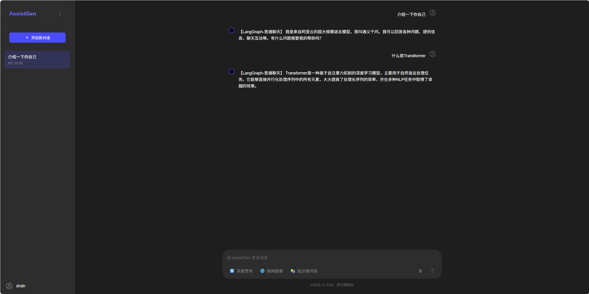
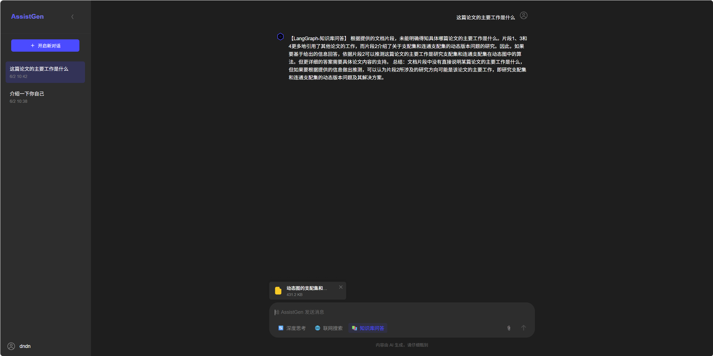
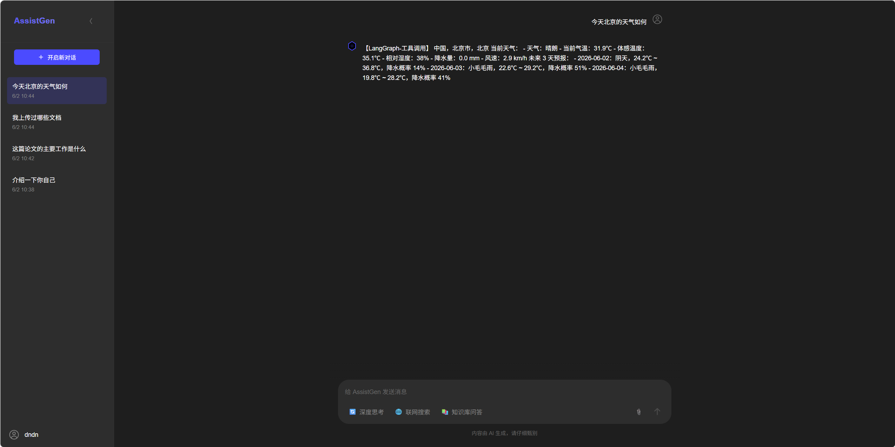
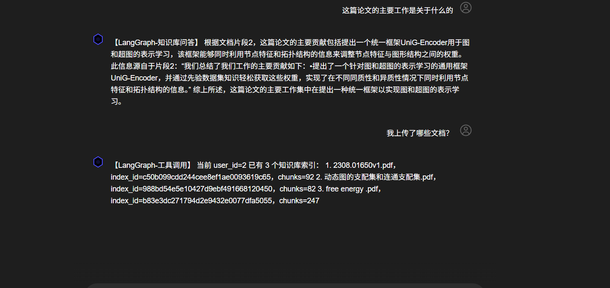

# Assist-Agent-RAG - 基于本地大模型的 RAG Agent 问答系统
Assist-Agent-RAG 是一个基于 FastAPI、Ollama、FAISS 和 LangGraph 构建的本地 RAG Agent 问答系统。
接入 qwen2.5:7b 作为本地聊天模型，使用 bge-m3 作为文本向量模型，同时还可支持切换多种大语言模型，如DeepSeek V3、Llama3系列等。
本项目支持用户注册登录、普通聊天、文档上传、知识库问答、工具调用等功能。

## 项目功能

### 1. 普通聊天
用户可以在主页面直接进行问题搜索


### 2. 知识库问答
用户可以上传文档，本系统根据文档内容进行回答


### 3. 工具调用
项目基于 LangGraph 实现了轻量级 Agent Router，可以根据用户问题自动选择不同处理流程，目前在工具调用方面主要实现了天气预报功能。



## 快速启动

### 1. 安装依赖

```bash
# 创建虚拟环境
python -m venv .venv

# 激活虚拟环境
# Windows
.venv\Scripts\activate
# Linux/Mac
source .venv/bin/activate

# 安装依赖
pip install -r requirements.txt
```

### 2. 配置环境变量

复制 `env.example` 文件到 `llm_backend/.env` 文件中，并根据实际情况修改配置：

```env
# LLM 服务配置
CHAT_SERVICE=OLLAMA  # 或 DEEPSEEK
REASON_SERVICE=OLLAMA  # 或 DEEPSEEK

# Ollama 配置
OLLAMA_CHAT_MODEL=qwen2.5:7b   # 聊天模型
OLLAMA_REASON_MODEL=qwen2.5:7b  # 推理模型
OLLAMA_AGENT_MODEL=qwen2.5:7b  # Agent模型
OLLAMA_EMBEDDING_MODEL=bge-m3  # 词向量模型

# DeepSeek 配置（如果使用）
DEEPSEEK_API_KEY=your-api-key
DEEPSEEK_BASE_URL=https://api.deepseek.com/v1
DEEPSEEK_MODEL=deepseek-chat
```
### 3. 安装Mysql数据库并在 `.env` 文件中配置数据库连接信息

### 4. 启动！！！

```bash
# 启动 MySQL、Redis、Ollama服务
service mysql start  
service redis-server start
nohup ollama serve > /tmp/ollama.log 2>&1 &

# 检查 Ollama、Redis服务是否启动成功
curl http://127.0.0.1:11434/api/tags
redis-cli ping

# 启动！！！
cd llm_backend
python run.py
```

服务启动后可以访问：
- 前端界面：http://localhost:8000

## 技术栈
- Python
- FastAPI
- Redis
- MySQL
- LangGraph
- FAISS
- RAG
  